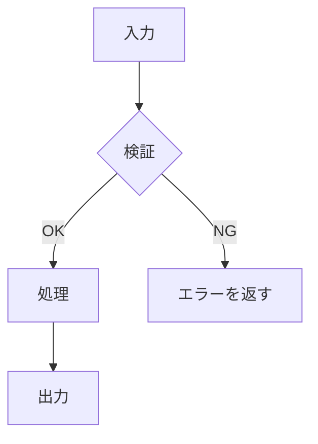
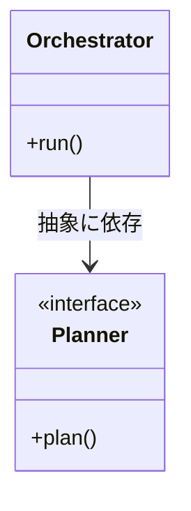

<!--
  Issue 実装準備完了テンプレート (ステージ 2: status:ready 用)。
  prepare__issue が issue-preparer agent の計画レポートを元に、親 Issue 本文をこの構成へ更新する。
  「要件定義」の各セクション (概要〜目標) は acknowledged 時点の本文から保持し、書き換えない。
  受入基準のみ、技術観点で計測可能な条件へ更新してよい。
  この HTML コメントは更新前に必ず削除する。
-->
## 概要

[acknowledged 時点の本文を保持する。]

## 背景

[acknowledged 時点の本文を保持する。]

## 課題

[acknowledged 時点の本文を保持する。]

<!-- バグ報告のときのみ残す -->
## 根本原因

[acknowledged 時点の本文を保持する。調査で原因が確定した場合のみ「調査中」を確定内容へ更新する。]

<!-- 機能開発のときのみ残す -->
## ユーザーストーリー

[acknowledged 時点の本文を保持する。]

## 目標

[acknowledged 時点の本文を保持する。]

## 提案手法

[具体的な実装方針を述べる。ファイルパス付きのコードスニペットで「どう変えるか」を示す。]

### 採用案

`path/to/file.ext`

```diff
- 変更前のコード
+ 変更後のコード
```

### ロジックフロー

[採用案の処理の流れを flowchart で示す。分岐とエラー経路 (失敗レール) を含める。]



### コンポーネント関係

[変更・新規のコンポーネントと依存方向を classDiagram で示す。クラスが主役でない対象 (シェルスクリプト・設定・スキル群など) では graph によるコンポーネント図で代替してよい。依存方向は上位層から下位層への一方向を保つ。]



### 検討した代替案

| 案 | 長所 | 短所 | 採否 |
|----|------|------|------|
| A: [採用案] | ... | ... | 採用 |
| B: [代替案] | ... | ... | 不採用 |

## 検証方法

[提案手法が正しく機能することをどう確かめるか。テストの追加・手動確認の手順・計測方法などを具体的に書く。]

## 受入基準

[この Issue を Close してよい条件を、技術観点で計測可能な箇条書きへ更新する。チェックボックス形式にし、各項目は客観的に検証できる表現にする。]

- [ ] [条件 1: 例「`foo()` が入力 0 件のとき `None` を返す」]
- [ ] [条件 2: 例「該当ケースの単体テストが追加され通過する」]

## SP

[人間が実装したときの所要時間を基準に、1 SP = 1 時間で見積もる。8 SP 以上になる作業単位は分割必須で、サブイシューは 7 SP 以下に収める。親 Issue の SP はサブイシューの SP の合計とする。]

- 親 Issue 合計: [N] SP

## サブイシュー一覧

[1 PR で完結する粒度 (7 SP 以下) に分割したサブイシューを列挙する。依存関係と並行可否が分かるようにする。]

| # | タイトル | SP | 依存 |
|---|---|---|---|
| 1 | [サブイシュー 1] | [SP] | なし |
| 2 | [サブイシュー 2] | [SP] | #1 |
| 3 | [サブイシュー 3] | [SP] | #1 (#2 と並行可能) |

## 補足

[acknowledged 時点の内容に、実装上の前提・制約を追記する。なければ省略する。]

## 用語集

[acknowledged 時点の内容に、提案手法で新たに登場した専門用語を追記する。]

## 参考文献

[acknowledged 時点の内容に、調査で見つかった関連資料を追記する。]
